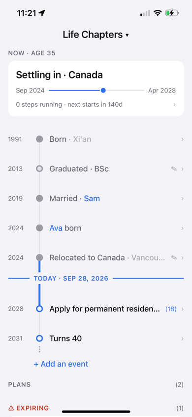
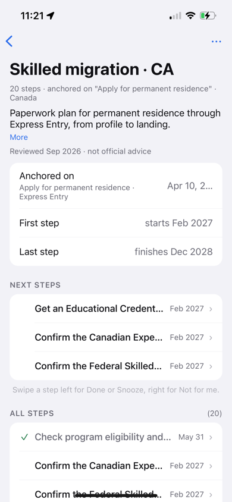
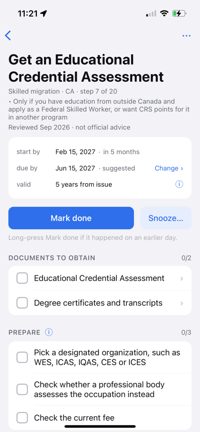
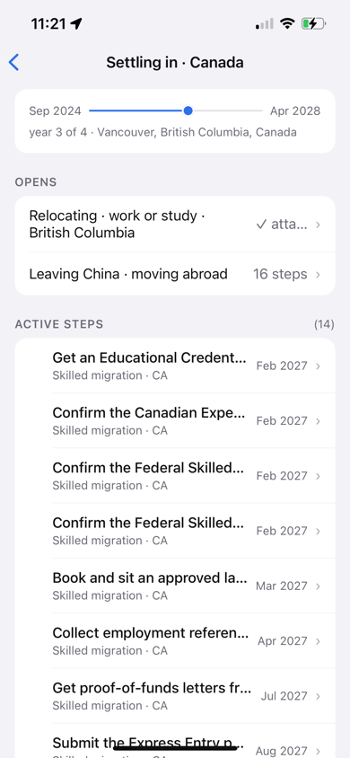
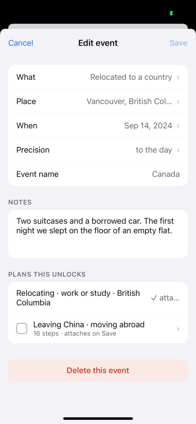
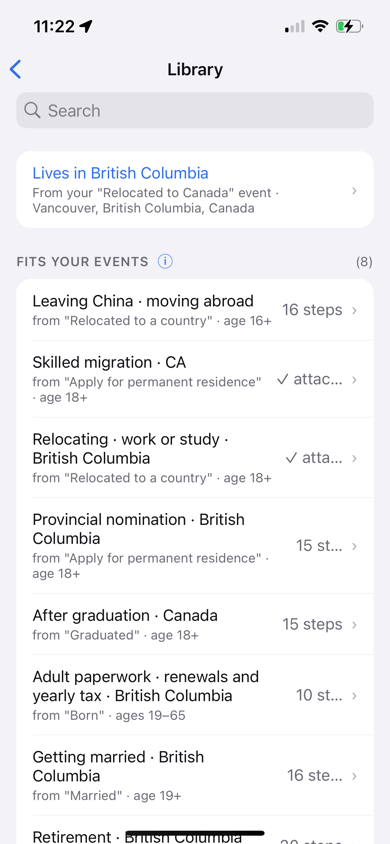
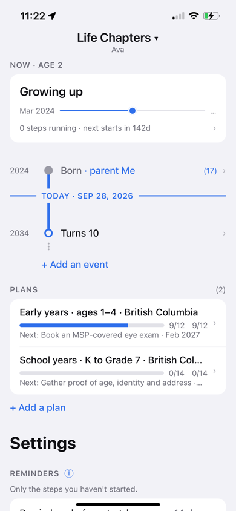
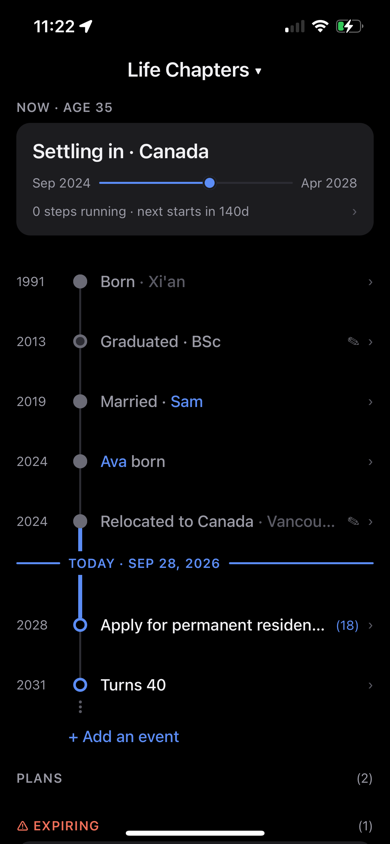

# Life Chapters

The life behind you and the plan ahead, on one line. Past dates hold your
notes; future chapters hold the steps to get there — and the plan reschedules
itself.

Enter the dates that actually matter — born, graduated, relocated, a child's
birth — and the app works out the rest: the chapter you're in, what's coming, and
every step you need to start *now* for something years away to land on time.

Mark one step done and the whole downstream series moves with it.

```
  1991  ● Born · Xi'an                    ›
        │
  2013  ◍ Graduated · BSc                 ›
        │
  2024  ● Relocated to Canada             ›
        ┃
  ══════ TODAY · Sep 26, 2026 ═════════════
        ┃
  2027  ○ Mom and Dad arrive         (14) ›
        ┃
  2028  ○ Apply for permanent resid… (19) ›
        │
  2031  ○ Turns 40                        ›
        ⋮
```

## Why it isn't a to-do app

Deadlines here are computed, never typed. A step declares how long it takes,
how long its result stays valid, and what it depends on — then it's scheduled
**backward** from the event it serves:

```
dueBy    = anchorDate + offsetDays
latest   = dueBy − durationDays
earliest = dueBy − validForDays − durationDays
startBy  = max(latest, when every dependency actually finishes)
```

So a police check good for only 3 months gets planned late on purpose, and a
skills assessment that takes 4 months shows up in **ACT NOW** two years before
the visa it belongs to. Finish something early and its successors reflow off the
real date, not the estimate.

## What's in it

One page, no tabs:

- **Timeline** — the life line, dates behind you and events ahead, cut into
  chapters; visits and trips sit on it without starting a chapter; notes on
  any date
- **People** — a board each for you, a partner, a child; a shared birth or
  wedding sits on both boards and moves as one
- **Plans** — playbooks you attach, turned into dated steps; each shows its
  next step, and its page what to start now and next; expiring documents on top
- **Settings** — at the bottom: reminders, backups (a daily copy plus a
  change log), playbook sources
- Local reminders ahead of each step's start-by date, for everyone

Bundled playbooks cover Canada (federal, plus Ontario and British Columbia)
and China:

- **Life stages**, each place: marriage, expecting, newborn, early years,
  school, high school (中考 / 高考 in China), growing up, graduating, a job,
  moving home, buying a home, retirement; yearly adult paperwork (tax,
  renewals, 社保 / 公积金)
- **Life turns**: job ended, starting a business, moving in together,
  separation and divorce, caring for a family member, a parent turning 60
  (China), a death in the family, buying a car, selling a home
- **Relocation**: arriving on a work or study permit, Express Entry,
  provincial nomination, citizenship; relocating to China with Chinese family
- **Visitors and travel**: visitors to Canada (eTA, visa, super visa),
  travelling to China, a child born in Canada to a Chinese parent

Each says who it's for — an age range and "applies if" lines. A person's
plans follow where they live, read from where they last moved, and a date with its own place — a wedding elsewhere — follows that.
China plans are in English with Chinese terms. The United States: coming
soon.

Fully offline. No account, no server, no subscription — nothing leaves the
phone unless you set it up: an optional daily backup file in your own iCloud
Drive, a calendar you mirror start-by dates into, or a file you export. Playbooks are plain data you can edit, fork, and share as a file — and
they are **not advice**, just a plan you maintain.

Design, screen drawings, build plan and release kit: [`docs/`](docs/).

## Development

Bare React Native — **no Expo**, Metro as the bundler, iPhone only.

```sh
npm install
npm run pods          # bundle install first, once
npm test              # engine, store, reminder queue, content
npm run typecheck
npm run ios           # physical device
make help             # release build, App Store upload, screenshots
```

Releasing: [`docs/release/`](docs/release/) — every App Store Connect field ready to
paste, the privacy policy, and `make release` to archive and upload.

`ios/LifeChapters.xcworkspace` for Xcode. Signing is not committed — put your
team and bundle id in a gitignored `ios/Local.xcconfig`:

```
DEVELOPMENT_TEAM = ABCDE12345
PRODUCT_BUNDLE_IDENTIFIER = com.yourname.lifechapters
```

### Physical device only

QA runs on a real iPhone. Don't fall back to a simulator for anything but a
compile check.

## Screenshots

Sample data on an iPhone 14 (`scripts/device-shots.sh`).

### Timeline
Your life line: chapters behind you, today, and the events ahead.



### Plan
A plan's page: when it starts and ends, the next steps, then every step.



### Step
What to get, what to prepare, and when to start so it lands on time.



### Chapter
One stretch of life: how far in, the plans it opens, its steps.



### Event
An event with its place, notes, and the plans it unlocks.



### Library
Plans by country and province, with the ones that fit your events first.



### A child's board
Every person gets their own life line and plans; names link between boards.



### Dark mode


